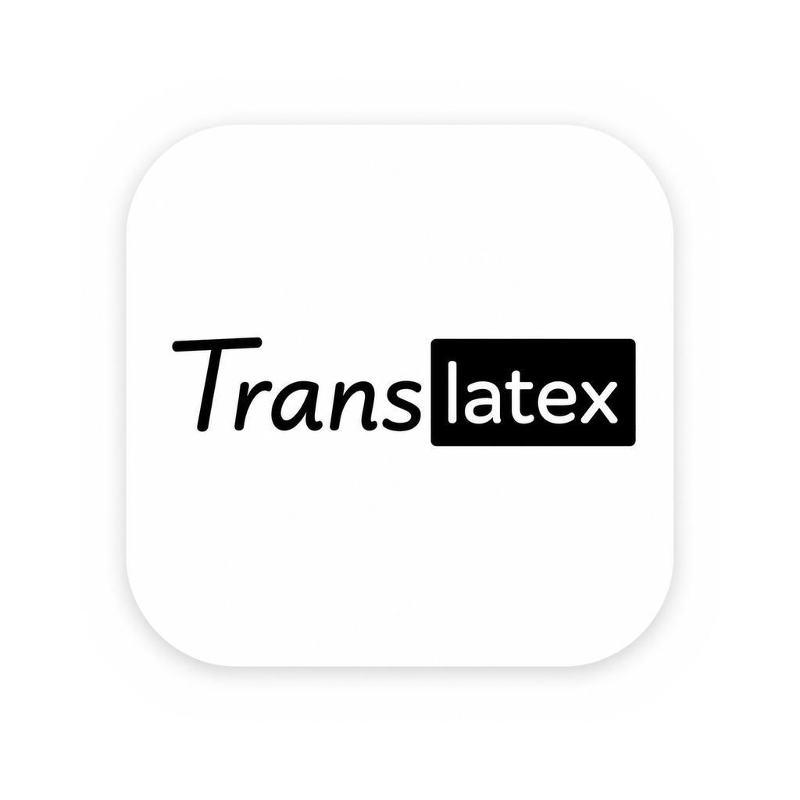
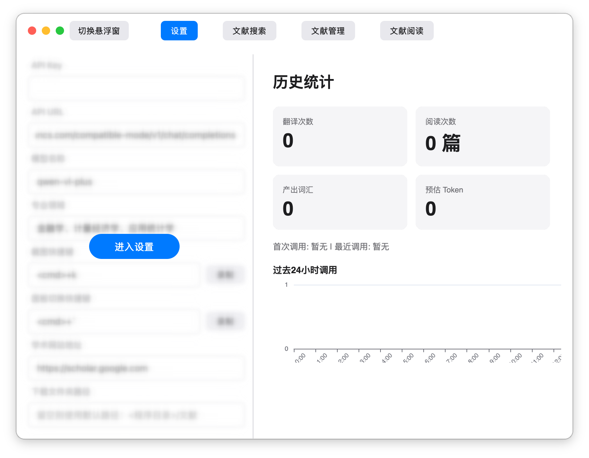

<div align="center">



# translatex

🚀 **一键截图，AI 翻译学术文献** — 仅支持 macOS

[](https://www.python.org/)
[]()
[](LICENSE)

</div>

---

## 💡 一句话介绍

**translatex** 是一款面向研究者与学生的桌面端学术翻译工具。框选屏幕任意区域，即可通过大模型将其中的英文文献实时翻译为带 latex 格式的流畅的中文学术表达，同时包含文献管理、PDF 阅读、笔记标注与知识图谱生成功能。

---

## ✨ 核心功能

| 功能 | 说明 |
|------|------|
| 📸 **截图翻译** | 全局快捷键唤起十字准星，框选屏幕上的英文论文区域，实时流式输出带 latex 渲染的中文翻译，公式友好 |
| 📚 **文献管理** | 支持 PDF / EPUB 等多种格式，文件夹分类、拖拽移动、全文检索 |
| 📖 **PDF 阅读器** | 内置阅读器、页码跳转、缩放控制|
| 📝 **笔记标注** | 在 PDF 页面任意位置打点标注，关联翻译与问答记录 |
| 🗨️ **追问答疑** | 对翻译结果进行追问，由大模型结合上下文深度解答 |
| 🕸️ **笔记引擎** | 一键生成文献概述、题目整理、知识图谱、词汇表 |
| 🌐 **学术搜索** | 内置浏览器，直达 Google Scholar 等学术网站，下载文献自动归档 |



---

## 📦 安装教程

> **只想用，不想折腾？** → 直接跳到 [方式一：下载即用](#方式一下载即用推荐)  
> **想改代码或自己打包？** → 看 [方式二：从源码运行](#方式二从源码运行)

---

### 方式一：下载即用（推荐）

1. 前往 [Releases](https://github.com/Orange-Jam212/Translatex/releases) 页面
2. 下载最新的 `translatex.dmg`
3. 双击 `translatex.dmg` 挂载，将 `translatex.app` 拖到桌面（不要放 Applications，因为需要解除隔离）
4. 打开终端（Terminal），输入以下命令**不要回车**：
   ```
   sudo xattr -r -d com.apple.quarantine
   ```
5. 在上面的命令后面按一下**空格**，然后把桌面的 `translatex.app` **拖进终端窗口**，路径会自动填入
6. **回车**执行，输入你的 Mac 密码（输密码时屏幕不会显示，正常）
7. 双击桌面上的 `translatex.app` 运行，macOS 会提示需要**辅助功能权限**——去 **系统设置 → 隐私与安全性 → 辅助功能** 中勾选 `translatex`
8. 重新打开软件，按 **`⌘+K`** 截图，期间如果弹出新权限请求，全部允许即可

---

### 方式二：从源码运行

#### 环境要求

- **操作系统**：仅支持 macOS（测试于 14/15）
- **Python**：3.9+（3.9 实测可用，其他版本请自行测试）

```bash
# 克隆仓库
git clone https://github.com/Orange-Jam212/translatex.git
cd translatex

# 安装依赖
pip install -r requirements.txt

# 启动
python latex.py
```

#### 自行打包为 .app

```bash
pip install pyinstaller
python package.py
```

打包完成后，`dist/translatex.app` 即为自包含的独立应用，可拷贝给他人使用。桌面会自动创建快捷方式。

---

## 🔑 如何配置 API

translatex 依赖视觉大模型 API 完成翻译与问答，目前支持兼容 OpenAI 接口的服务（如OpenAI、阿里千问等）。

### 配置步骤

1. **获取 API Key**  
   以阿里百炼为例：前往 [阿里云百炼控制台](https://bailian.console.aliyun.com/) → API Key 页面创建密钥。
 
 2. **打开设置面板**  
    启动 translatex 后，点击顶部导航栏的 **「设置」**，然后点击 **「进入设置」** 解锁。
 
 3. **填入配置（以阿里百炼为例）**
 
    | 配置项 | 说明 | 示例值 |
    |--------|------|--------|
    | API Key | 你的大模型 API 密钥 | `sk-ws-xxxxxxxx` |
    | API URL | 兼容 OpenAI 的接口地址 | `https://{WorkspaceId}.cn-beijing.maas.aliyuncs.com/compatible-mode/v1/chat/completions` |
   | 模型名称 | 需要支持视觉的多模态模型 | `qwen-vl-plus` |
   | 专业领域 | 你的研究方向，影响翻译语气 | `金融学、计量经济学` |

4. **保存即生效**  
   修改即时保存，无需重启。

> ⚠️ **注意**：API Key 仅存储于本地 `settings.json`，不会上传到任何服务器。

---

## 📖 功能教程

translatex 提供两种交互界面，自由切换：

| 界面 | 特点 |
|------|------|
| 🖥️ **主控台** | 全功能面板，包含设置、文献管理、学术搜索、阅读器四大板块 |
| 🫧 **悬浮窗** | 轻量毛玻璃弹窗，专注翻译 + 追问，适合阅读时随手截屏 |

> 按下 `` Cmd + ` `` 可一键弹起 / 最小化悬浮窗。

---

### 📸 截图翻译（核心功能）

1. 按下全局快捷键（默认 `Cmd + K`）  
2. 屏幕出现十字准星，框选文献中的英文段落  
3. 松开鼠标，翻译结果流式显示在悬浮窗中  
4. 可以在下方对话框继续追问不懂的内容  

> 快捷键可在「设置」中自定义（支持录制任意组合键）


---

### 📚 文献管理

- 点击 **「文献管理」** 进入管理面板  
- 点击 **「上传文献」** 导入 PDF/EPUB 等文件  
- 支持新建文件夹分类、拖拽移动文献、搜索查找  
- 从学术网站下载的 PDF 自动归档到「下载」文件夹

---

### 📖 PDF 阅读与笔记

- 点击 **「文献阅读」**，左侧目录树选择文献即可阅读  
- 页面跳转、缩放：顶部工具栏支持  
- **打点记笔记**：点击「💾 Note」进入标定模式，在 PDF 正文中点击任意位置落点，自动关联当前翻译与问答记录  
- 笔记列表支持文件夹分类，右键可重命名/删除  
- **单击笔记** 自动跳转到 PDF 对应页面；**双击笔记** 进入 Markdown 编辑器进行修改


---

### 🕸️ 笔记处理引擎

- 在「文献阅读」板块，点击 **「📋 笔记功能」**  
- 勾选需要处理的笔记，选择引擎类型：
  - **文献概述**：提取文章核心论点与个人思考
  - **题目整理**：梳理 Q&A 与推导过程
  - **知识图谱**：生成 Mermaid 概念拓扑图
  - **词汇表**：中英对照专业术语词典
  - **自定义指令**：输入你自己的 Prompt，AI 按你的特殊要求处理笔记


---

## ⌨️ 快捷键

| 快捷键 | 功能 |
|--------|------|
| `Cmd + K` | 截图翻译（默认，可自定义） |
| `` Cmd + ` `` | 悬浮窗弹起 / 最小化 |

所有快捷键均可在「设置」面板中录制自定义。

---

## ❓ 常见问题

<details>
<summary><b>Q: 翻译结果出现大段英文？</b></summary>

请检查「模型名称」是否配置为支持视觉的多模态模型（如 `qwen-vl-plus`），而非纯文本模型。
</details>

<details>
<summary><b>Q: 截图快捷键不生效？</b></summary>

macOS 需要在 **系统设置 → 隐私与安全性 → 辅助功能** 中授权终端（或打包后的 .app）的辅助功能权限。
</details>

<details>
<summary><b>Q: API 请求失败？</b></summary>

请检查：① API Key 是否正确；② API URL 是否可达；③ 账户是否有可用额度；④ 是否使用了多模态大模型（纯文本模型无法识别图片）。
</details>

<details>
<summary><b>Q: PDF 无法加载？</b></summary>

PDF 文件大小限制为 50MB。超出此限制的文件请预先压缩。
</details>

---

## 🤝 反馈与帮助

- 🐛 **提交 Bug**：[GitHub Issues](https://github.com/Orange-Jam212/translatex/issues)
- 💡 **功能建议**：欢迎在 Issues 中提出新功能构想
- 📧 **邮件联系**：jice3739262@gmail.com

---

## 📄 开源协议

本项目采用 [MIT License](LICENSE) 开源。

---

<div align="center">
  <sub>Made with ❤️ for researchers</sub>
</div>
